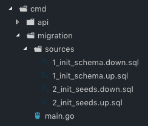

A CLI library that let's you easily work with PostgreSQL migration files. It is intended to be wrapped by your own application. It uses https://github.com/golang-migrate/migrate under the hood. Might supprt the same amount of databases at a later date when demand is there.

I created this package to have a migration binary in my app's /cmd folder that uses the same database config (.env) as the rest of the app. There are probably easier ways to do migrations, but I wanted to try it out this way. I also found it handy to have my migrations files and migration logic in the same place.


### How to use

1. `go get github.com/Flur3x/go-migrate-cli` to download this package

2. Prepare migration files in a folder of your choice [(Migration file format)](https://github.com/golang-migrate/migrate/blob/master/MIGRATIONS.md)

**Example**
This is how I organized the migration files in my own app:



3. Use it in your own appliaction, e.g. like this:

```go
import "github.com/Flur3x/go-migrate-cli"

func main() {
	db := database.Connection()

	migrate.CLI(db, "my-database-name", "cmd/migration/sources")
}
```

4. Start it, e.g. with `go run cmd/migration/main.go`, depending on your individual folder structure
5. May the CLI be with you 😎

### Be warned

This is one of my first go projects and I wouldn't use it in production yet.
