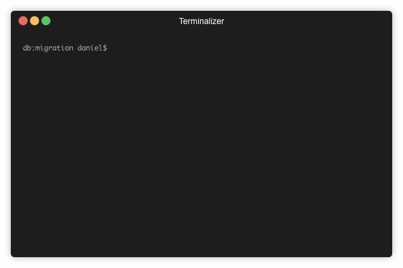

A CLI library that let's you easily work with PostgreSQL migration files. It is intended to be wrapped by your own application.

It uses https://github.com/golang-migrate/migrate under the hood. Might supprt the same amount of databases at a later date when demand is there.



### How to use

1. Download the package: `go get github.com/Flur3x/go-migrate-cli`

2. Grepare your migration files with correct names in a folder of your choice [(Migration file format)](https://github.com/golang-migrate/migrate/blob/master/MIGRATIONS.md)

3. Use it in your own appliaction:

```go
import "github.com/Flur3x/go-migrate-cli"

func main() {
	db, err := database.Connection()

	if err != nil {
		panic(err)
	}

	migrate.CLI(db, "my-database-name", "cmd/migration/sources")
}
```

4. Start your app, may the CLI be with you 😎

### Be warned

This is one of my first go projects and I wouldn't use it in production yet.
